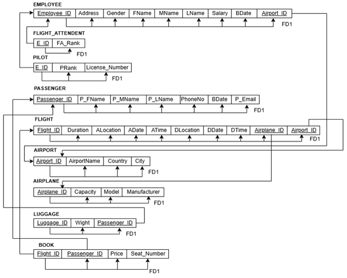

# Airport Database System

A relational database system designed and implemented in Oracle SQL to manage airport operations, including flight scheduling, aircraft assignments, passenger bookings, luggage tracking, and personnel allocation.

---

## 📌 Database Overview & Architecture
The system manages operational data across 9 core entities:
* **Airports & Aircraft:** Facilities, runway terminals, airplane capacities, models, and manufacturers.
* **Flight Schedules:** Route tracking, arrival/departure destinations, dates, and times.
* **Personnel Management:** Categorized into flight attendants and certified pilots with rank and licensing records.
* **Passengers & Ticketing:** Booking details, dynamic seat allocations, ticket fares, and weight-tracked luggage.

---

## 📐 Conceptual & Logical Design

### Enhanced Entity-Relationship (EER) Model
* **Specialization/Generalization:** `EMPLOYEE` is designed as a superclass with disjoint specialization into `PILOT` and `FLIGHT_ATTENDANT`.
* **Cardinalities:**
  * One-to-Many (`1:N`) between `AIRPORT` and `FLIGHT`.
  * One-to-Many (`1:N`) between `AIRPLANE` and `FLIGHT`.
  * One-to-Many (`1:N`) between `PASSENGER` and `LUGGAGE`.
  * Many-to-Many (`M:N`) between `FLIGHT` and `PASSENGER` (resolved via associative table `BOOK`).

### Relational Schema & Normalization (3NF)
Every relation in the schema was verified against Normalization forms:
* **1NF:** Elimination of composite and multivalued attributes (atomic values throughout).
* **2NF:** Elimination of partial functional dependencies; all non-key attributes depend on composite primary keys.
* **3NF:** Elimination of transitive dependencies; all non-key attributes depend directly on the primary key.

---

## 🛠️ Implementation Details
* **RDBMS:** Oracle Database / Oracle SQL Developer.
* **Referential Integrity:** Enforced via explicit `PRIMARY KEY` and `FOREIGN KEY` constraints across all relationships.
* **Scripts Included:**
  * `schema.sql`: Table definitions (DDL) with data types, defaults, and integrity constraints.
  * `seed-data.sql`: Test data populating 5+ records per table.
  * `queries.sql`: Analytical queries, multi-table joins, subqueries, aggregations, and database views.
